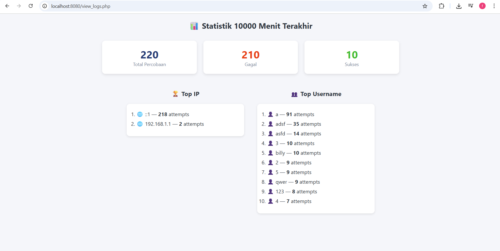
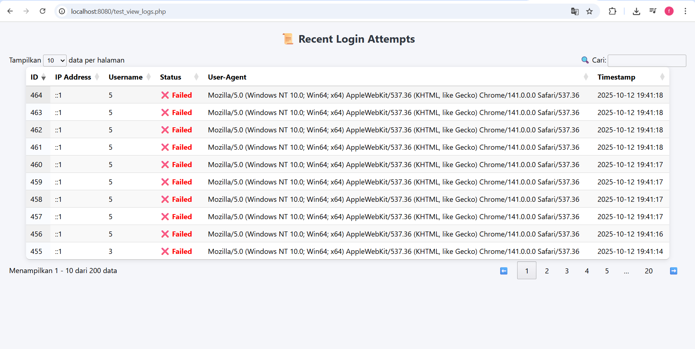
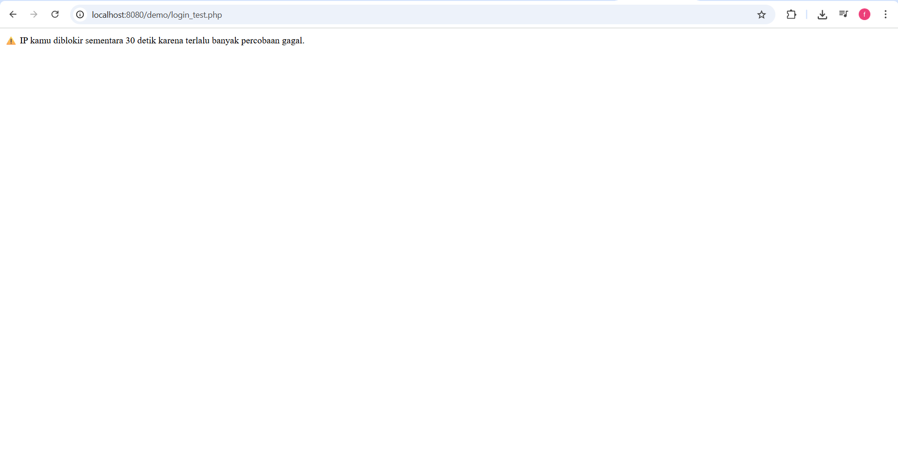

### 🧠 PHP Login Attempt Logger

Sebuah sistem pencatat percobaan login (login attempt logger) berbasis PHP + MySQL yang mencatat setiap percobaan login (berhasil maupun gagal), menampilkan log dengan tampilan DataTables, dan menyediakan statistik seperti Top IP, Top Username, serta jumlah login sukses/gagal.

---

### 🚀 Fitur Utama

✅ Mencatat setiap percobaan login ke database 
<br>
✅ Menampilkan riwayat login dengan tampilan DataTables (interaktif & pencarian cepat)
<br>
✅ Menampilkan statistik login (total, sukses, gagal, top IP, top username)
<br>
✅ Dapat mengaktifkan fitur pemblokiran otomatis berdasarkan percobaan gagal berulang
<br>
✅ Mudah diintegrasikan ke sistem login apapun
<br>
✅ Menggunakan PDO (secure & prepared statement)
<br>

---

### 📂 Struktur Direktori

```
bf_logger/
├── checker.php        # Class utama (logger) -> FILE CORE
├── config.php         # Konfigurasi database & pengaturan logger
├── login.php          # Contoh form login (demo) -> BISA DI SESUAIKAN
├── log.php            # Halaman untuk menampilkan log (DataTables) -> BISA DISESUAIKAN DENGAN PEMANGGILAN FUNGSI DIBAWAH INI
├── stats.php          # Halaman untuk menampilkan statistik login -> BISA DISESUAIKAN DENGAN PEMANGGILAN FUNGSI DIBAWAH INI
└── README.md          # Dokumentasi proyek (file ini)

```

### 🧰 Persyaratan

- PHP 8.0 atau lebih baru
- MySQL / MariaDB
- Ekstensi PDO aktif
- Server web (Apache / Nginx / XAMPP / Laragon, dll)

---

### ⚙️ Instalasi

1. Clone repository
```bash
git clone https://github.com/username/bf_logger.git
cd bf_logger
```

2. Import Database dengan Query dibawah ini

```sql
CREATE DATABASE IF NOT EXISTS bf_logger CHARACTER SET utf8mb4 COLLATE utf8mb4_general_ci;
USE bf_logger;

CREATE TABLE IF NOT EXISTS login_attempts (
  id INT AUTO_INCREMENT PRIMARY KEY,
  ip VARCHAR(45) NOT NULL,
  username VARCHAR(255) DEFAULT NULL,
  user_agent VARCHAR(512) DEFAULT NULL,
  success TINYINT(1) NOT NULL DEFAULT 0,
  created_at DATETIME NOT NULL DEFAULT CURRENT_TIMESTAMP,
  INDEX idx_ip_created_at (ip, created_at),
  INDEX idx_username_created_at (username, created_at)
);
```

3. Edit file konfigurasi _Buka config.php dan sesuaikan pengaturan berikut:_


```php
'db' => [
    'dsn'  => 'mysql:host=localhost;dbname=bf_logger;charset=utf8mb4',
    'user' => 'root',       // ubah sesuai user MySQL
    'pass' => '',           // ubah sesuai password MySQL
],
```

4. Jalankan di browser

- Buka login.php → untuk mencoba login demo

- Buka log.php → untuk melihat semua log

- Buka stats.php → untuk melihat statistik login

---

### ⚙️ Penyesuaian Fungsi 

_a. Penyimpanan Log_

```php

<?php
require __DIR__ . "/checker.php";
$logger = new logger();

if(auth() === SUKSES){ #Sesuaikan dengan logika coding anda
    $logger->success_login();
}else{
    $logger->fail_login();
}

?>

```

_b. Visualisasi Semua Log_

```php
<?php
require __DIR__ . '/checker.php';
$log = new logger();

$log->view_logs(); #Bisa anda bungkus dengan css apapun dan bisa di sesuaikan
?>
```

_c. Visualisasi Statistik_

```php

<?php
require __DIR__ . '/checker.php';
$log = new logger();

$log->view_stats(); #Bisa anda bungkus dengan css apapun dan bisa di sesuaikan
?>

```

---

### 🔑 Contoh Login Demo

Path berada di ./demo/login_test.php

| Username | Password   | Status     |
| -------- | ---------- | ---------- |
| anjay    | slebew     | ✅ Berhasil |
| lainnya  | (apa saja) | ❌ Gagal    |

---

### 🧱 Konfigurasi Tambahan

Semua konfigurasi diatur di ./config.php:

| Parameter          | Default | Deskripsi                                            |
| ------------------ | ------- | ---------------------------------------------------- |
| `key_username`   | `10000` | Berikan sesuai input name username anda (```<input type="text" name="*USERNAME*">```) <br><br> *<b>*ITU YANG DISESUAIKAN</b>*|
| `BLOCK_USER`       | `false` | Aktifkan blokir otomatis IP pengguna                 |
| `MAX_FAILED_INPUT` | `5`     | Jumlah gagal sebelum diblokir                        |
| `BLOCK_DURATION`   | `30`    | Lama blokir dalam detik                              |
| `TIME_FAIL_INPUT`  | `30`    | Rentang waktu percobaan gagal berturut-turut (detik) |
| `WINDOW_MINUTES`   | `10000` | Rentang waktu (menit) untuk statistik                |
|`DESCRIPTION_MAX_FAILED_ATTEMPTS` | `⚠️ IP kamu diblokir sementara 30 detik karena terlalu banyak percobaan gagal.` |  Deskripsi jika percobaan gagal berkali-kali |


Contoh: 

```php

"BLOCK_USER" => true,  // Aktifkan fitur blokir otomatis
```

---

### 📊 Tampilan Output

- Visual Statistik



- Visual Semua Riwayat Percobaan



- Visual jika user gagal berkali - kali



---

### 🔒 Tentang Keamanan

1. Menggunakan Prepared Statements (PDO) → aman dari SQL Injection
2. IP user otomatis dideteksi via $_SERVER
3. Sistem pemblokiran opsional untuk mencegah brute-force attack
4. Tidak menyimpan password pengguna

---

### 🧑‍💻 Kontributor

Author: 0xbilly
License: MIT
GitHub: https://github.com/0xbillyyy/bf_logger

---

### 🧾 Lisensi

Proyek ini dirilis di bawah lisensi MIT, yang berarti bebas digunakan dan dimodifikasi untuk kebutuhan pribadi atau komersial, dengan tetap mencantumkan atribusi kepada pembuat aslinya.

---

### ❤️ Dukungan

Jika proyek ini bermanfaat, silakan ⭐ star repo ini di GitHub atau kirim feedback / pull request untuk perbaikan.